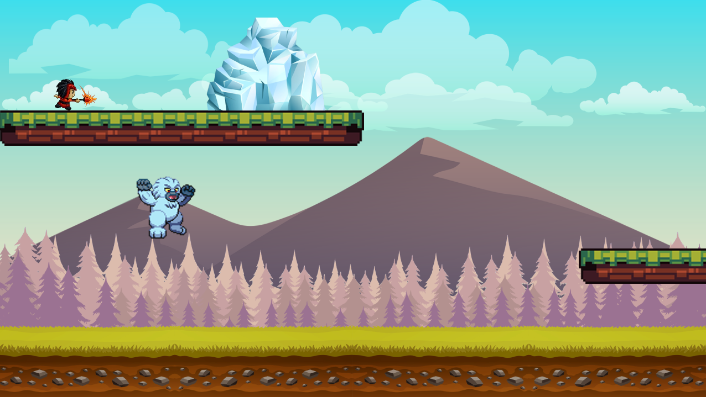
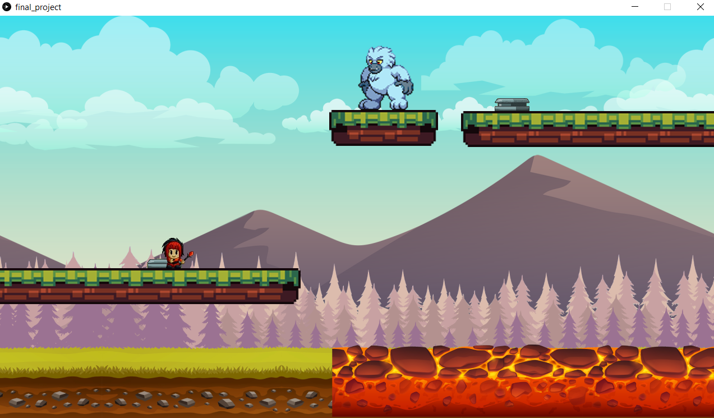
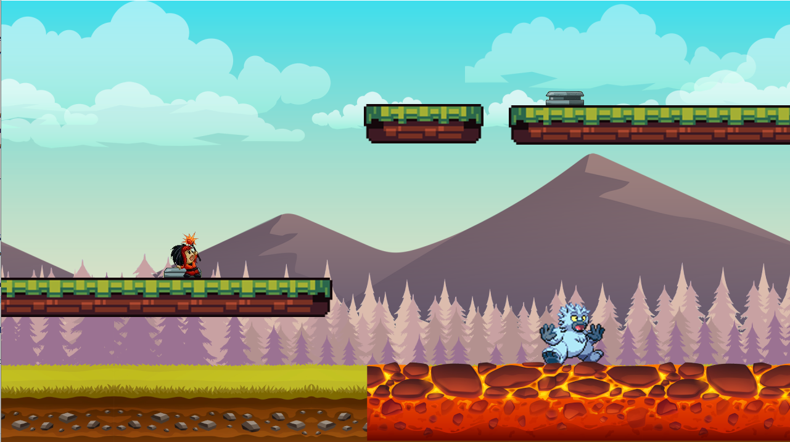

# Frost and Flame

## Description
This is a two-player puzzle game developed by Ayyub Shaffy and Matija Susic as a final project for our Introduction to Computer Science class. The game features sprite-based graphics and requires coordination between two players to solve puzzles and progress through the level.

## Game Features

- Two playable characters with distinct abilities
- Cooperative gameplay requiring coordination between players
- Puzzle elements that challenge players to work together
- Single horizontal level with scrolling (x_shift)
- Sprite-based graphics

## Controls

- Player 1 (Fire Mage): WASD keys for movement, r for special ability
- Player 2 (Ice Yeti): Arrow keys for movement, l for special ability

## Technical Implementation
The game is built using object-oriented programming principles in Processing (Python), with classes for various entities in the game environment, including:

- Characters (Fire Mage and Ice Yeti)
- Platforms
- Other interactive elements

## Game Screenshots

